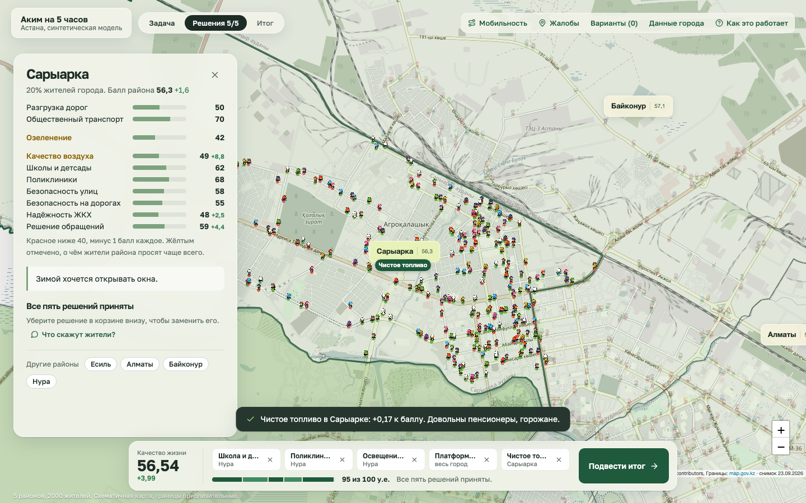
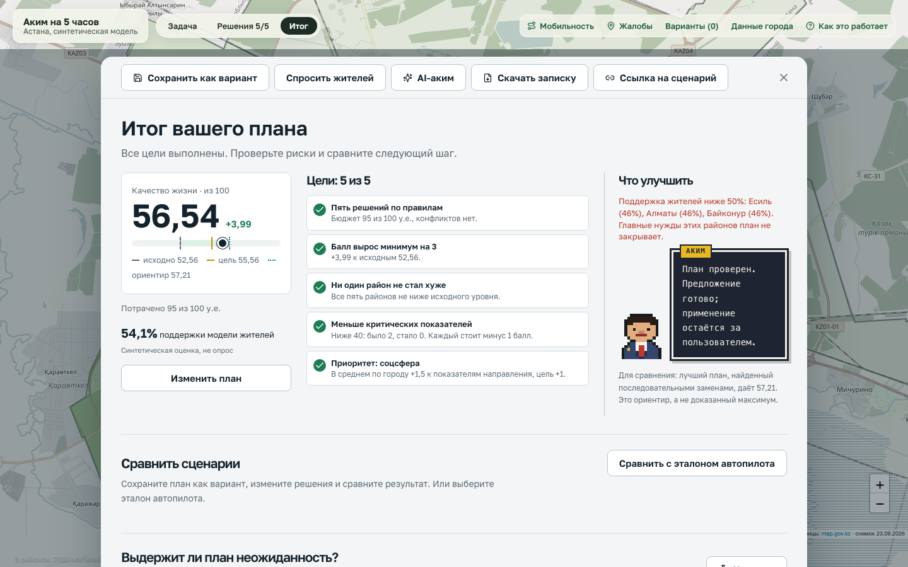
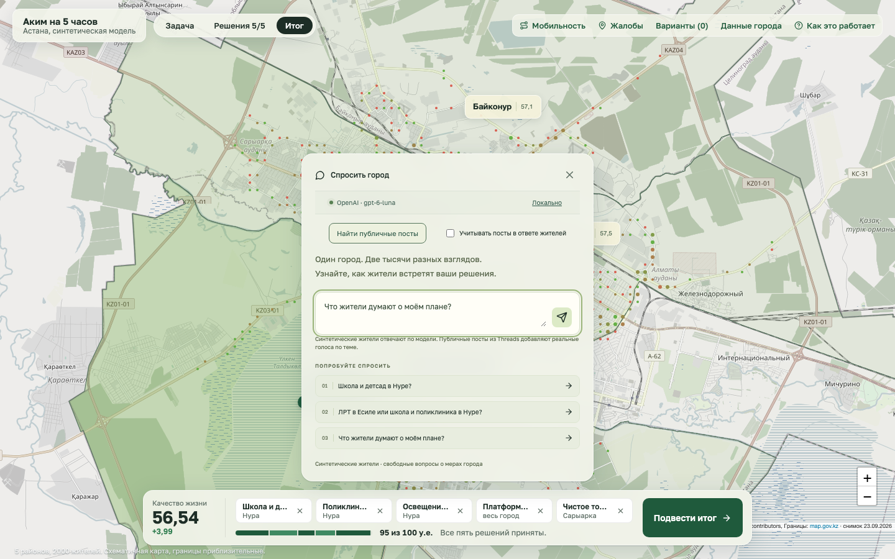
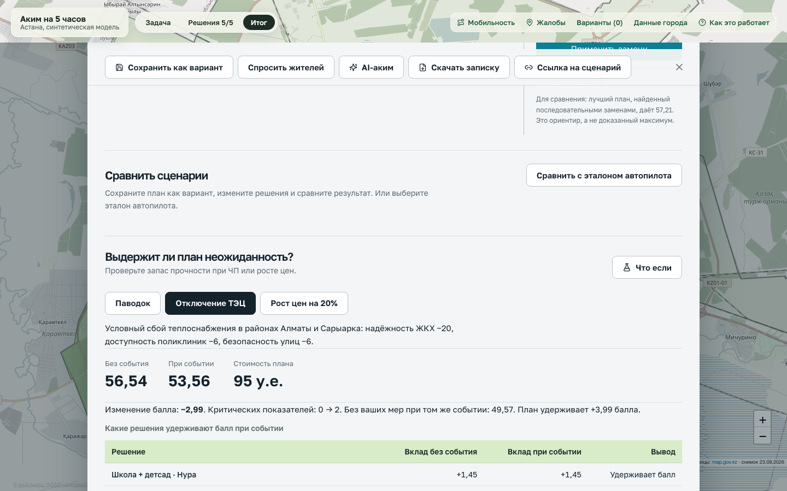
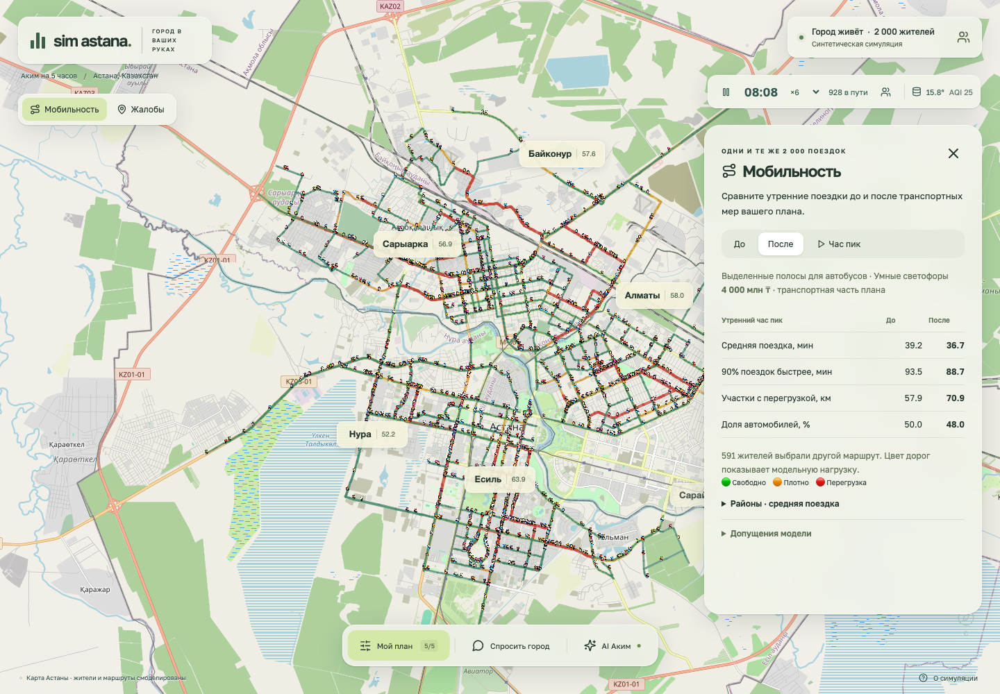
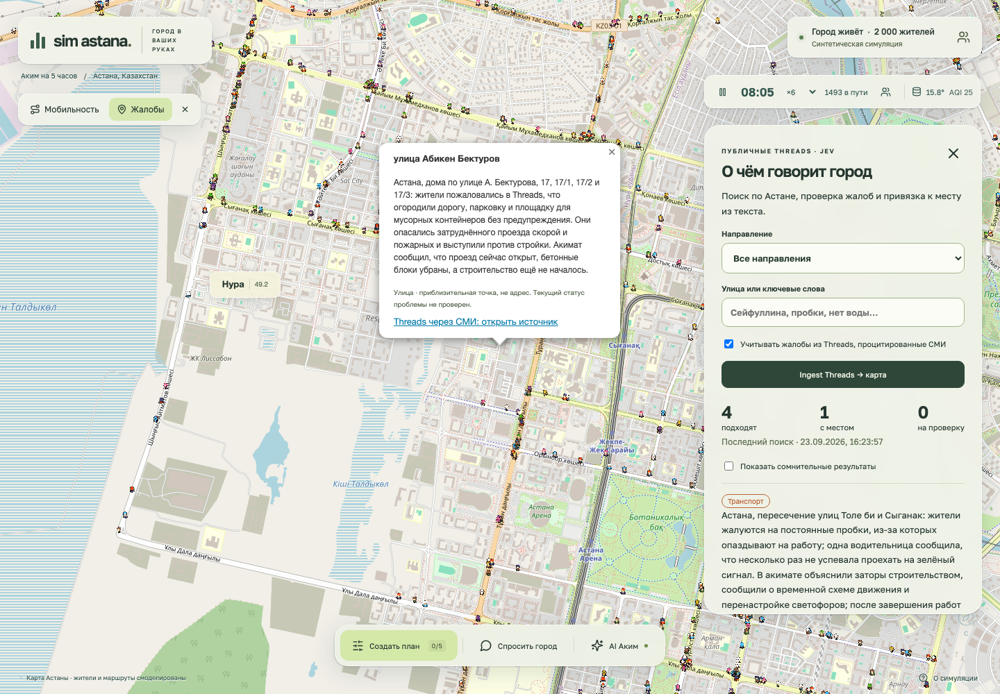

# Stroit AI — «Аким на 5 часов»

AI-симулятор управления Астаной: 5 решений, бюджет 100 у.е., 5 районов и 2 000 синтетических жителей. Детерминированный движок считает балл качества жизни, AI-аким объясняет результат и предлагает замены.

Кейс команды на **HackAlem AI 2026** · [Публичная версия](https://sim-astana.diaskhalniyasov.workers.dev)


## Установка

Нужны **Node.js 22+** и npm. Ключи не нужны.

```sh
cd akim/ui
npm ci
npm run build
npm start
```

Откройте **http://127.0.0.1:8791**. Для разработки вместо сборки: `npm run dev` — UI на **http://127.0.0.1:5173**, API на 8791.

### Опционально: AI-аким

В корне репозитория:

```sh
cp .env.example .env
```

Впишите `OPENAI_API_KEY` (для поиска жалоб — ещё `JEV_API_KEY`) и перезапустите сервер. Ключ остаётся на сервере и не попадает в браузер. Без ключа сообщение «OpenAI not configured» ожидаемо: игра, балл, жители, локальный совет, «Что если» и записка работают полностью.

## Скриншоты

| | |
| --- | --- |
| **Карта и пять решений** — район, 14 мер, бюджет, живые жители | **Итог плана** — балл, цели, AI-аким |
|  |  |
| **Спросить город** — 2 000 синтетических жителей и публичные посты | **Что если** — паводок, отключение ТЭЦ, рост цен |
|  |  |
| **Мобильность** — поездки до и после мер | **Жалобы** — публичные источники на карте |
|  |  |

## Как играть

1. Выберите приоритет и район, затем **5 мер из 14** (не более 2 одного направления, бюджет 100 у.е.) или нажмите **«Посмотреть готовый пример»**.
2. **Итог плана**: Astana Quality of Life Score, четыре цели, вклад каждого решения, таблица районов по 10 показателям через 8 кварталов.
3. **Жители**: поддержка по районам и профилям; **«Совет акима»** перебирает замены одного решения.
4. Сохраняйте **варианты** и сравнивайте их, проверяйте план в **«Что если»**, скачивайте **записку** в PDF. Ссылка хранит план в параметрах `plan` и `vs`.

## Как устроено

Код — [`akim/ui`](akim/ui): **React + TypeScript + Vite**, **Leaflet / OpenStreetMap**, **Canvas**, **Express API на tsx**; публичный деплой — **Cloudflare Worker**.

**Числа считает детерминированный движок, LLM только объясняет и предлагает.** Балл: 70% среднее по городу, 30% самый слабый район, минус 1 за каждый показатель ниже 40 ([правила](akim/file.md)). Одинаковый ввод даёт одинаковый балл. С ключом модель **gpt-6-luna** через OpenAI Responses ведёт AI-акима с инструментами «симулировать», «спросить город», «предложить план» и ищет публикации Threads.

Панель **«Данные города»** показывает реальные данные с источником, датой и статусом live / cached / unavailable: Open-Meteo, CAMS, ДТП KGP ArcGIS, население БНС, реестр районов map.gov.kz. Они дают контекст AI и не меняют синтетические индексы.

API: `GET /api/health`, `GET /api/city`, `POST /api/ask`, `POST /api/explain`, `POST /api/akim`, `POST /api/threads/ingest`.

## Проверка

Из `akim/ui`:

```sh
npm test
npx playwright install chromium && npx playwright test --project=desktop
```

Браузерные тесты используют фикстуры API без платных вызовов. Скриншоты и GIF обновляет `npx tsx scripts/readme-media.ts` при запущенных `npm run dev:api` и `npm run dev:ui -- --port 5178` (нужен ffmpeg).

## Документы

[ТЗ кейса](akim/tz.md) · [Датасет и правила](akim/file.md) · [Концепция продукта](akim/PROJECT.md) · [README приложения](akim/ui/README.md)

## Ограничения

Датасет и жители синтетические, персональных данных нет; поддержка жителей — модель, а не опрос. В игре 5 районов, в реестре 6: Сарайшык без балла. Стоимость мер — сценарная оценка, не смета.

## Команда

- **Диас Халниязов**, капитан — движок, API, деплой, AI-аким.
- **Ардан** — продукт, интерфейсы, проверка, README.
