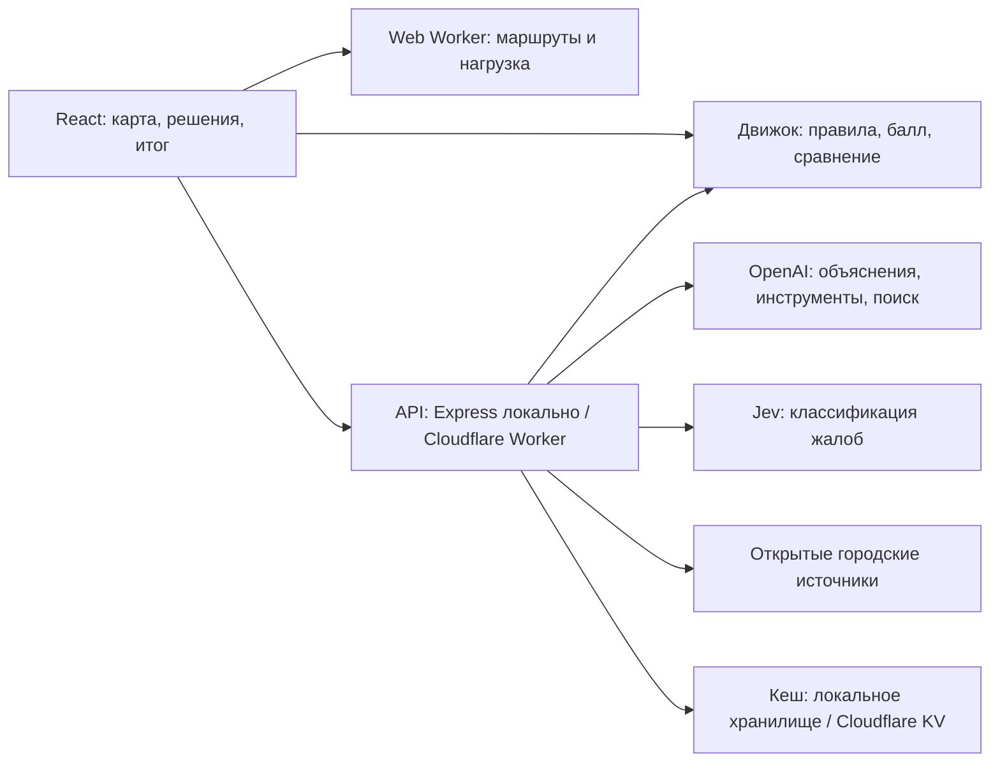

# «Аким на 5 часов» — AI-симулятор управления Астаной

**Пять решений. Бюджет 100 у.е. Один город, в котором важно улучшить жизнь каждого района.**

Проект команды **Stroit AI** для кейса **Sim Astana** на **HackAlem AI 2026**. Пользователь распределяет бюджет между городскими инициативами, видит изменения на карте и получает итоговый **Astana Quality of Life Score** с объяснением сильных сторон, рисков и компромиссов.

[Открыть демо](https://sim-astana.diaskhalniyasov.workers.dev) · [Запустить локально](#быстрый-запуск) · [Пройти сценарий проверки](#демонстрация-за-пять-минут) · [Техническая документация](akim/ui/README.md) · [Условия кейса](akim/tz.md)

Основной игровой сценарий воспроизводится **без API-ключей**. Живые ответы AI и поиск публикаций подключаются отдельно. Целевой формат интерфейса — **десктоп, 1440 px**. Публичный сайт обновляется отдельным деплоем и может отставать от кода в репозитории.

## Зачем это нужно

Развитие города требует выбора между транспортом, экологией, социальной инфраструктурой, безопасностью и городскими сервисами. При ограниченном бюджете недостаточно улучшить среднюю цифру: решение может оставить слабый район позади, снизить поддержку жителей или не выдержать роста цен.

Симулятор помогает городскому управленцу, аналитику или участнику обучения сравнить такие решения в общей модели. Все начинают с одинаковыми данными и бюджетом. Результат можно объяснить, сопоставить с другим вариантом и оформить в записку руководству.

Это прототип для исследования сценариев и обучения. Он не заменяет городское планирование, инженерные расчёты или реальный опрос жителей.

## Возможности

| Возможность | Что получает пользователь |
| --- | --- |
| Игра на карте | Введение → брифинг → выбор пяти мер по районам → итог поверх карты. Стоимость и ограничения видны во время выбора. |
| Объяснимый итог | Балл, достижение целей, изменения десяти показателей в каждом районе, вклад мер, риски и следующая возможная замена. |
| Сравнение сценариев | До трёх сохранённых вариантов с переименованием и загрузкой. Сравнение балла, бюджета, целей, поддержки и районов; ссылка на оба плана. |
| AI-аким | Совет по замене, автопилот и подбор плана по цели: приоритеты, резерв бюджета, защита районов, обязательные и запрещённые меры. Предложение применяется по действию пользователя. |
| Реакция жителей | 2 000 синтетических жителей, шесть профилей интересов в каждом районе. Расчёт поддержки и объяснение того, кому помогает план. |
| «Что если» | Паводок, отключение ТЭЦ и рост цен на 20%. Пересчёт по правилам движка с открытыми допущениями и вкладом выбранных мер. |
| Записка руководству | Один лист A4: план, стоимость, балл, цели, риски и поддержка жителей. Печать или сохранение в PDF. |
| Мобильность | Сравнение одних и тех же поездок до и после транспортных мер: время, доля автомобилей, перегрузка улиц и маршруты на карте. |
| Карта жалоб | Поиск публичных публикаций, проверка связи с Астаной и темой жалобы через Jev, привязка подтверждённого места к карте. |
| Данные города | Погода, воздух, ДТП, население и реестр районов с источниками, датами и статусом доступности. |

## Демонстрация за пять минут

Для чистого старта откройте приложение в приватном окне: обычный браузер может восстановить прошлый план и три сохранённых варианта. Для проверки без платных AI-вызовов используйте локальный запуск без ключей.

1. Откройте приложение и нажмите **«Стать акимом»**. Ознакомьтесь с брифингом, при желании выберите до двух приоритетов и нажмите **«Начать: район Нура»**.
2. Нажмите на Нуру на карте. Через панель района добавьте **«Школа и детсад»**, **«Поликлиника»**, **«Освещение и камеры»**, затем городскую **«Платформу обращений»**. Для пятого решения выберите **«Чистое топливо»** в Сарыарке. Если нужной меры нет среди предложенных, нажмите **«Все 14 мер»**, затем **«Построить»** рядом с ней.
3. Нажмите **«Подвести итог»**. Этот план стоит **95 у.е.** и даёт **56,54** балла вместо исходных **52,56**. Все четыре базовые цели выполнены. Тот же план доступен через **«Посмотреть готовый пример»** на первом экране.
4. Нажмите **«Сохранить как вариант»**, затем **«Изменить план»**. Уберите «Чистое топливо» из корзины, откройте Нуру и постройте **«ЛРТ»** через «Все 14 мер». Снова подведите итог: расход станет **100 у.е.**, балл — **57,21**. Сравнение покажет усиление транспорта Нуры и потерю улучшения экологии Сарыарки. В локальном режиме ту же замену можно применить кнопкой **«Применить замену»**. Параметры `plan` и `vs` позволяют передать сравнение ссылкой.
5. Через «Варианты» загрузите сохранённый исходный план, снова подведите итог и откройте **«Что если»**. На этом плане рост цен на 20% увеличивает расход с **95 до 114 у.е.**: приложение показывает дефицит **14 у.е.** и не присваивает недопустимому плану балл.
6. Нажмите **«Скачать записку»** и выберите в системном окне печати сохранение в PDF. Для дополнительных сценариев откройте **«Мобильность»**, **«Спросить жителей»** или **«AI-аким»**.

План сохраняется в браузере и URL. Стресс-сценарий не меняет сохранённые решения и обычный балл. Поддержка жителей в отчёте — результат модели, не социологический опрос.

## Быстрый запуск

Нужен **Git**. Проверенная среда: **Node.js 25.8.2 и npm 11.11.1**. Ранние версии Node.js 22 не подходят части зависимостей в lock-файле: для ветки 22 используйте как минимум **22.20.0**. Из нового каталога:

```sh
git clone https://github.com/BAITC-Hacks/hack-5caf5332-stroit-ai.git
cd hack-5caf5332-stroit-ai/akim/ui
npm ci
npm run build
npm start
```

Откройте **http://127.0.0.1:8791**. Express обслуживает собранный интерфейс и API. Сообщение `OpenAI not configured` ожидаемо при запуске без ключа: игра, расчёт балла, сравнение, стресс-тест, печать и мобильность работают.

Если репозиторий уже скачан, начните с `cd akim/ui`. Для другого порта:

```sh
API_PORT=8792 npm start
```

Для разработки после установки зависимостей:

```sh
npm run dev
```

Интерфейс: **http://127.0.0.1:5173**, API: **http://127.0.0.1:8791**. Vite проксирует `/api`; при смене порта API нужно обновить [vite.config.ts](akim/ui/vite.config.ts). `npm run preview` показывает только статическую сборку и не заменяет API-сервер.

Интернет нужен для установки зависимостей, фоновой карты, обновления внешних данных и живых AI-функций. Основной расчёт плана не обращается к LLM.

## Режимы и настройка AI

| Функция | Без ключей | С настроенными ключами |
| --- | --- | --- |
| Балл, правила, сравнение, стресс, PDF, мобильность | Полностью доступны | Тот же детерминированный расчёт |
| Советник и автопилот | Локальный поиск допустимых замен и планов | AI использует инструменты и объясняет проверенный результат |
| Цель AI-акима | Структурированные ограничения | Дополнительно разбор цели, сформулированной словами |
| Спросить жителей | Локальная модель и шаблонные реплики | Структурированные ответы LLM по профилям жителей |
| Публичные публикации Threads | Живой поиск недоступен | Поиск через OpenAI; карта жалоб дополнительно требует Jev |

В [серверном адаптере](akim/ui/server/llm.ts) по умолчанию задана модель **`gpt-6-luna`** через OpenAI Responses API. Используются структурированные ответы, вызовы инструментов и веб-поиск. Модель можно изменить через `OPENAI_MODEL`, если она доступна в вашем аккаунте. Классификатор жалоб настроен на **Jev `jev-1.13.0`**.

| Переменная | Назначение |
| --- | --- |
| `OPENAI_API_KEY` | Живой AI-аким, объяснения, ответы жителей и поиск публикаций |
| `OPENAI_MODEL` | Модель OpenAI; по умолчанию `gpt-6-luna` |
| `JEV_API_KEY` | Проверка жалоб и подтверждение места для карты |
| `API_PORT` | Порт Express; по умолчанию `8791` |
| `API_HOST` | Адрес Express; по умолчанию `127.0.0.1` |
| `SESSION_SECRET` | Секрет подписи токенов запросов в Cloudflare Worker |

Передавайте ключи через серверное окружение из хранилища секретов. На macOS, если записи уже созданы в Keychain:

```sh
export OPENAI_API_KEY="$(security find-generic-password -s OPENAI_API_KEY -w)"
export JEV_API_KEY="$(security find-generic-password -s JEV_API_KEY -w)"
npm start
```

Для AI без карты жалоб достаточно первого ключа. Альтернатива — менеджер секретов или защищённый файл вне репозитория, например в `~/.secrets/` с правами `600`. Не размещайте ключи в клиентских переменных `VITE_*`, исходниках или коммитах. После изменения окружения перезапустите сервер. Живые обращения используют квоты и тарификацию провайдеров.

При настроенном OpenAI приложение автоматически включает живой режим. Открытие итогового листа и изменение плана на нём запускают AI-советника и объяснение с контекстом городских данных и сохранённых жалоб. Это платные вызовы без отдельной кнопки запуска. В панели AI-акима или опроса можно переключиться кнопкой **«Локально»**. Локальный балл и печатная записка от AI-ответов не зависят.

## Как считается результат

Источник правил — [датасет кейса](akim/file.md), реализация — [engine.ts](akim/ui/src/engine.ts).

- Пять игровых районов: Есиль, Алматы, Сарыарка, Байконур и Нура.
- Четырнадцать доступных мер по пяти направлениям; итоговый план содержит ровно пять уникальных мер.
- Бюджет — **100 условных единиц**, не более двух мер на направление. Районные меры требуют район; городские применяются ко всему городу.
- До расчёта итога проверяются бюджет, конфликты и корректность выбора. Недопустимый план не получает итоговый балл.
- У каждого района десять индексов от 0 до 100: по два на транспорт, экологию, соцсферу, безопасность и сервисы. Чем выше индекс, тем лучше.
- Горизонт оценки — **8 кварталов**. Эффекты учитывают задержку запуска: `эффект × (8 − lag) / 8`. Далее добавляются синергии, показатели ограничиваются диапазоном 0–100.

```text
Score = 0,7 × средний балл районов с весами населения
      + 0,3 × балл самого слабого района
      − число показателей строго ниже 40
```

Балл района — взвешенная сумма его десяти индексов. Каждый показатель ниже 40 даёт штраф в один балл. Базовые цели: допустимые пять решений, прирост минимум на три балла, отсутствие ухудшения районов и уменьшение числа критических показателей.

**Числа считает движок; AI анализирует и предлагает.** Сервер проверяет предложенные планы и ограничения цели. Одинаковый план даёт одинаковый игровой балл; тексты и живые ответы LLM могут различаться. Локальный поиск предлагает улучшения, но не доказывает глобальный оптимум.

В стресс-тесте шок применяется после эффектов мер и синергий, перед ограничением показателей и расчётом Score. Его допущения показаны в интерфейсе и [stress.ts](akim/ui/src/planner/stress.ts). Вклад меры считается сравнением с тем же событием без этой меры; скрытых бонусов защиты нет.

## Архитектура



| Часть | Технологии и ответственность |
| --- | --- |
| Интерфейс | React 19, TypeScript, Vite, Lucide; игровой путь и отчёты |
| Карта | Leaflet, OpenStreetMap, Canvas; жители с уровнями детализации при зуме |
| Модель | Общий TypeScript-движок для браузера и сервера, синтетическое население |
| Анализ мобильности | Web Worker, граф улиц OSM, сравнение фиксированного спроса на поездки |
| Локальный сервер | Express 5, tsx, проверка схем через Zod |
| Публичная версия | Cloudflare Worker, статические ресурсы, KV и ограничения частоты запросов |
| AI | OpenAI Responses и Jev; ключи остаются на сервере |
| Проверки | Node test runner через tsx, Playwright, TypeScript |

### API

| Метод и маршрут | Назначение |
| --- | --- |
| `GET /api/health` | Доступность интеграций, модель и токен для запросов |
| `GET /api/city` | Нормализованные городские данные с датами и источниками |
| `GET /api/complaints` | Последняя сохранённая подборка жалоб |
| `POST /api/ask` | Реакция модели жителей на предложение или план |
| `POST /api/akim` | Советник, автопилот или подбор по цели |
| `POST /api/explain` | AI-объяснение результатов плана |
| `POST /api/threads/ingest` | Поиск публичных публикаций по теме |
| `POST /api/complaints/ingest` | Поиск, классификация и привязка жалоб к карте |

Точный контракт задают [схемы запросов](akim/ui/server/schemas.ts), [клиент API](akim/ui/src/services.tsx) и серверные обработчики. Для изменяющих запросов клиент использует `X-Sim-Token`, полученный через `/api/health`. Внешний веб-поиск запускается по действию пользователя.

## Данные и ограничения модели

| Источник | Использование | Ограничение |
| --- | --- | --- |
| [Синтетический датасет](akim/file.md) | Индексы, бюджет, меры, эффекты и синергии | Сценарные допущения, не измерения реального города |
| OpenStreetMap и геопортал map.gov.kz | Подложка, улицы и границы районов | В игре пять районов; Сарайшык показан без игрового балла |
| Open-Meteo и CAMS | Погода и качество воздуха | Модельные данные; источник и дата показаны в панели |
| KGP ArcGIS | Записи ДТП за 2026 год | Выборка в ограничивающем прямоугольнике, не официальный итог по границе Астаны |
| Бюро национальной статистики | Справочные данные о населении | Датированное наблюдение, не счётчик в реальном времени |
| Публичные Threads и СМИ с цитатами | Контекст городских жалоб | Неполная индексация; AI-пересказ не подтверждает актуальность проблемы |

Для городских данных интерфейс показывает источник, дату наблюдения и статус `live`, `cached` или `unavailable`. Недоступный источник даёт датированный снимок либо явное отсутствие данных. Погода, воздух и внешние публикации не переписывают исходные индексы игрового движка.

Жители вымышленные; игровые профили не содержат персональных данных. Публичные публикации — отдельный источник с прямыми ссылками. Jev проверяет принадлежность к Астане, наличие жалобы, направление и место. Сомнительные результаты отделены; неподтверждённые адресные привязки не получают пинов. Пин обозначает приблизительное место улицы или района, а не домашний адрес автора.

Мобильность сравнивает фиксированные синтетические пары дом–работа внутри района. Модель не учитывает межрайонные поездки, правила одностороннего движения и реальную трассу ЛРТ. Стоимость мер — условный бюджет, не строительная смета. Стресс-события — допущения для сравнения устойчивости, не прогноз ЧП.

## Проверка и воспроизводимость

Из `akim/ui`:

```sh
npx tsc --noEmit
npx tsc -b --noEmit
npx tsc -p tsconfig.worker.json --noEmit
npm test
npm run build
npx playwright install chromium
npx playwright test --project=desktop --reporter=line
```

Последний полный прогон, результаты которого приведены ниже: **`da0dd85`**, включён в `main` через [PR #30](https://github.com/BAITC-Hacks/hack-5caf5332-stroit-ai/pull/30). Результаты на **23.09.2026**:

| Проверка | Результат |
| --- | --- |
| Unit-тесты | **61/61**: правила, серверная логика, население, сравнение, стресс, мобильность и проверка жалоб |
| Playwright | **17/17**: десктоп 1440 × 1000, игровой путь, панели, варианты, зум, мобильность, жалобы и печать |
| TypeScript | Приложение и Cloudflare Worker проходят проверку |
| Production build | Проходит; Vite предупреждает о размере основного JS-пакета |
| Печатная записка | PDF на одной странице A4 |

Playwright сам запускает Vite на порту **5178**. API и платные AI-вызовы в браузерных проверках заменены фикстурами. Это проверка поведения приложения, а не доступности провайдеров. Живые OpenAI/Jev-вызовы в этом прогоне не выполнялись. Мобильные форматы не входили в проверку. Эти результаты относятся к указанному коммиту; более поздние изменения AI-итога и размеров жителей требуют собственного полного прогона. При повторной проверке документации на основе `ff4009d` отдельно выполнены чистый `npm ci`, `npm run build` и `npm start`: интерфейс и `/api/health` доступны без ключей. Контрольные цифры демо повторно проверены движком.

Проверка внешних городских источников: `npm run data:check`. Отдельный `npx tsx server/check-jev.ts` выполняет **платные** проверки Jev на синтетических примерах; он не входит в стандартный `npm test`.

## Развёртывание на Cloudflare

Настройки находятся в [wrangler.jsonc](akim/ui/wrangler.jsonc). Один Worker обслуживает интерфейс и `/api/*`. Нужны аккаунт Cloudflare, KV-пространство и серверные секреты. Для другого аккаунта создайте собственное KV командой `npx wrangler kv namespace create CACHE`, замените ID привязки `CACHE` в конфигурации и проверьте имя Worker `name`, чтобы выбрать нужный проект.

Из `akim/ui`, в нужном аккаунте:

```sh
npx wrangler login
npm run build
npx wrangler secret put OPENAI_API_KEY
npx wrangler secret put JEV_API_KEY
npx wrangler secret put SESSION_SECRET
npm run check:cloud
npm run deploy
```

Секреты вводятся интерактивно из вашего хранилища. Для `SESSION_SECRET` нужен случайный стойкий секрет. Все три переменные объявлены обязательными в текущей конфигурации. `check:cloud` проверяет Worker и выполняет dry-run без публикации; `deploy` повторно собирает приложение и публикует его. При изменении привязок обновите типы через `npm run types:cloud`.

После деплоя проверьте `/api/health`, загрузите готовый пример и пройдите сценарий выше. Локальный Express не требует Cloudflare или KV: он использует локальный кеш.

## Если что-то не запускается

| Симптом | Что проверить |
| --- | --- |
| `OpenAI not configured` | Основная игра доступна. Для живого AI передайте серверу ключ и перезапустите процесс. |
| Занят порт 8791 | Выберите другой `API_PORT`; для режима Vite также обновите адрес прокси. |
| Открывается страница, но API недоступен | Запускайте `npm start` после сборки или `npm run dev`. Один `npm run preview` API не поднимает. |
| Playwright не находит браузер | Выполните `npx playwright install chromium`. |
| AI или Jev возвращает ошибку | Проверьте серверные ключи, доступ к модели, сеть и квоты. Подробности ключей не должны попадать в клиентские логи. |
| Поиск не нашёл жалоб | Это отсутствие подходящих индексируемых результатов; оно не означает отсутствие проблем в городе. |
| Источник города недоступен | Посмотрите дату кеша и статус в «Данных города»; выполните `npm run data:check`. |
| Публичное демо отличается от README | Сверьте развёрнутую версию с `main`; для воспроизводимой проверки запустите код локально. |

## Навигация по репозиторию

| Путь | Содержание |
| --- | --- |
| [akim/tz.md](akim/tz.md) | Задача и критерии оценки хакатона |
| [akim/file.md](akim/file.md) | Исходные данные и правила расчёта |
| [akim/ui/README.md](akim/ui/README.md) | Подробности приложения и интеграций |
| [akim/ui/src/game](akim/ui/src/game) | Игровой путь, панель района, корзина и варианты |
| [akim/ui/src/planner](akim/ui/src/planner) | Итог, сравнение, стресс-тест и печатная записка |
| [akim/ui/src/engine.ts](akim/ui/src/engine.ts) | Общий детерминированный движок |
| [akim/ui/server](akim/ui/server) | Express API, AI, источники и кеш |
| [akim/ui/worker](akim/ui/worker) | Cloudflare Worker |
| [akim/ui/tests](akim/ui/tests) | Unit- и браузерные тесты |
| [akim/PROJECT.md](akim/PROJECT.md) | Концепция и направления развития; содержит также планы, а не только реализованные функции |

## Команда и дальнейшее развитие

**Stroit AI:** Диас Халниязов — капитан, движок, API, AI-аким и деплой; Ардан — продукт, интерфейсы, проверка и документация.

Следующие направления: калибровка эффектов на городских данных, расширение районной и транспортной модели, оценка качества поиска жалоб на размеченной выборке. Это планы развития, а не заявленные возможности текущего прототипа.

## Источники графики и лицензии

Карта и граф улиц: © участники OpenStreetMap, ODbL 1.0. Спрайты жителей: работа @route1rodent, CC BY-SA 3.0. Происхождение, ссылки и условия использования перечислены в [ATTRIBUTION.md](akim/ui/docs/ATTRIBUTION.md), [MAP.md](akim/ui/docs/MAP.md) и [лицензии спрайтов](akim/ui/public/SPRITES-LICENSE.txt). Эти лицензии относятся к соответствующим ресурсам и не задают лицензию всего кода проекта.
