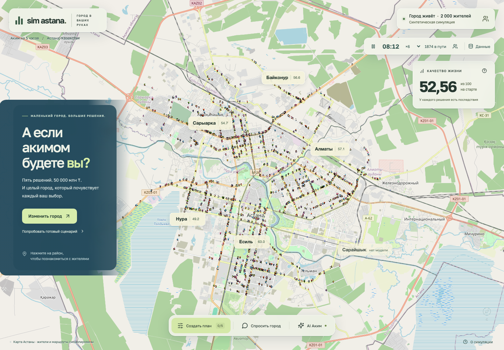

# Sim Astana · Аким на 5 часов

Russian-language city decision simulator: React, TypeScript, Leaflet, Canvas and a Cloudflare Worker API. Explore the city, choose five investments, ask simulated residents and compare AI Akim's proposals.

**Live:** https://sim-astana.diaskhalniyasov.workers.dev

## Run

Node.js 22+; run from `akim/ui`:

```sh
npm ci
cp .env.example .env
# Set OPENAI_API_KEY and JEV_API_KEY in .env. Never put it in VITE_* variables.
npm run dev
```

Open **http://127.0.0.1:5173**. Vite proxies `/api` to **127.0.0.1:8791**. To use another API port, update `.env` and the proxy in `vite.config.ts`. For a built app, `npm run build && npm start` serves both UI and API at **http://127.0.0.1:8791**. `npm run preview` is only a static preview; use `npm start` for live services.

The configured model is **`gpt-6-luna`**, using OpenAI Responses, structured outputs, function calls and low reasoning effort. The key stays on the server in an ignored `.env`; no key is returned to the browser. Without a key, explicitly labeled local resident/advisor modes remain available. Live failures show an error; they do not silently switch models.

Choose a district → create a plan or load the example → compare before/after → ask residents → open AI Akim and press **Проверить план с AI**. Proposals require **Apply** to change your plan. Plans persist in local storage. Escape closes panels. Reduced-motion settings pause the city clock initially.



[Mobile](docs/mobile.png) · [Real data panel](docs/sources.png) · [Resident profile](docs/resident.png)

## Real city data

`server/city-data.ts` calls the JSON endpoints documented in `akim/INVENTORY.md` / `akim/README.md` in the source workspace. `GET /api/city` exposes normalized records with source URL, attribution, observation date, retrieval date and **live / cached / unavailable** status.

| Source                                                                                                                                                                                                                                  | Usage                                                                | Limits                                                                                       |
| --------------------------------------------------------------------------------------------------------------------------------------------------------------------------------------------------------------------------------------- | -------------------------------------------------------------------- | -------------------------------------------------------------------------------------------- |
| [Open-Meteo weather](https://api.open-meteo.com/v1/forecast?latitude=51.1694&longitude=71.4491&current=temperature_2m,wind_speed_10m,weather_code&timezone=Asia%2FAlmaty)                                                               | Temperature, wind, weather code; context for AI and evening routines | Forecast model at a city point, not a station measurement                                    |
| [Open-Meteo / CAMS air](https://air-quality-api.open-meteo.com/v1/air-quality?latitude=51.1694&longitude=71.4491&current=pm2_5,pm10,european_aqi&timezone=Asia%2FAlmaty)                                                                | European AQI, PM2.5 and PM10; AI context                             | Modeled grid; no claim of district-level measurements                                        |
| [KGP ArcGIS DTP](https://gis.kgp.kz/arcgis/rest/services/KPSSU/DTP/FeatureServer/0)                                                                                                                                                     | Count of 2026 accident records within 71.2–71.65°E, 51.0–51.3°N      | Bounding box differs from the administrative city; not an official Astana total              |
| [Bureau of National Statistics, table 6584](https://stat.gov.kz/api/iblock/element/6584/json/file/ru/)                                                                                                                                  | Latest all-population Astana series; periods sorted by date          | Latest verified observation: 1,528,703 at 2025-12-31, not a live population counter          |
| [National Geoportal WFS](https://map.gov.kz/geoserver/ows?service=WFS&version=2.0.0&request=GetFeature&typeNames=geonode:border_districts&outputFormat=application/json&propertyName=kato,name_ru&CQL_FILTER=kato%20LIKE%20%2771%25%27) | Unique district KATO registry, deduplicating multipart entries       | Six real districts are shown; Sarayshyk has no synthetic score in the five-district game |

Weather/air cache for 15 minutes; other sources for 24 hours. Timeouts, invalid/partial responses and upstream failures return an explicitly dated saved snapshot or `unavailable`, never invented readings. `npm run data:check` prints concise endpoint status. Cached JSON lives in ignored `.cache/store` locally and Cloudflare KV in production.

Real data is supplied to the LLM as context. It does **not** overwrite the original synthetic quality-of-life indices, district weights or assumed policy effects. Refresh checks the server's cache policy; observation and retrieval times are shown separately.

## Public Threads evidence

In **Спросить город**, type a proposed decision and click **Ingest Threads**. Luna expands it into up to six searches covering the street, problem, synonyms and neutral/supportive alternatives in Russian, Kazakh and English. For a road near Seifullin, queries include `Астана Сейфуллина пробки`, `Astana Seifullin traffic` and `Астана устал от пробок`.

Search uses OpenAI Responses `web_search`, restricted to public `threads.com` / `threads.net` pages. The interface displays planned and executed queries, source links, AI paraphrases, complaint/support labels, and whether each post refers to the street or Astana generally. Only post URLs present in actual search sources are accepted. Publication dates are marked unconfirmed; invented posts and profile URLs are rejected. Enable **Учитывать при опросе** to search automatically with the next city question and supply the evidence to the synthetic resident model. Unsupported policy questions still return Threads evidence with a clarification notice.

This searches **web-indexed public posts**, not the complete Threads feed or a representative public survey. No matches means insufficient indexed evidence, not no complaints. Search results are reused within a 30-minute cache window. No Meta account/token is needed; no private posts or personal profiles are collected.

## Complaint map with Jev

Open **Жалобы**, optionally enter a street/problem or choose one of the five directions, then press **Ingest Threads → карта**. Luna searches and paraphrases public sources; **Jev `jev-1.13.0`** independently judges Astana relevance, whether a complaint exists, all five municipal directions, and a supported location. The latest completed collection is shared in Cloudflare KV for 24 hours and loads on reopening the app. Search results cache for 30 minutes.

Public Threads indexing is sparse. The enabled **СМИ с цитатами из Threads** option supplements fewer than three direct results with actual search sources from five named news domains. These cards and popups explicitly say **СМИ → Threads**, link to the article and retain official replies when present. Turn the option off for direct Threads posts only. Jev classifies AI paraphrases; neither full original posts, publication dates nor current unresolved status are verified. A historical complaint can already be resolved. Results are not a representative survey or a measure of complaint prevalence.

The classifier follows [Jev 1.13 guidance](https://docs.typesafe.ai/model-jaggedness/jev-1.13): one post per request, literal independent questions, untrusted evidence instructions, no model arithmetic, and a bounded choice of locally matched street/district names. At most four Jev requests run concurrently. Acceptance requires Astana probability ≥0.80, complaint probability ≥0.75 and at least one direction ≥0.75. Mapping additionally requires Choice confidence ≥0.65 and selected-location probability ≥0.75. These are application thresholds, not empirically validated accuracy guarantees. Uncertain items appear under review; unsupported or ambiguous locations stay off the map. Pins are approximate street/district points, not home addresses. Selecting a card focuses its pin; mobile closes the panel to reveal it.

The key is stored only in server environment variables / Worker secrets. No Jev output can supply arbitrary coordinates, source URLs or execute instructions. `npx tsx server/check-jev.ts` runs five explicitly synthetic, paid integration checks (Astana traffic, another city, an ad, praise/negation and an injected instruction). These fixtures never enter the complaint store and are a small regression sample, not a robustness benchmark.

## Before/after mobility

Open **Мобильность**, apply a plan or the bus-lanes/traffic-lights example, then switch **До / После** and replay the morning commute. The comparison keeps the same **2,000 synthetic home/work pairs** and departure times. It shows average and p90 trip duration, car share, congested street length, district differences and rerouted trips, with road loads drawn on the real OSM street graph. Computation runs in a Web Worker.

M1 changes bus speed/waiting, shifts a fixed share of travelers to buses and reduces car capacity in the chosen district. M2 reduces junction delay. M3 models idealized transit improvements along the existing street graph, **not the actual LRT alignment**. Other measures have no invented mobility effect. Speeds, demand, capacities, mode shifts and congestion costs are stated assumptions. Two deterministic assignment passes allow rerouting; they do not solve traffic equilibrium. Trips remain within the five modeled district components; one-way/access rules and inter-district commuting are omitted. This is a scenario comparison, **not a calibrated traffic forecast**. The example can improve average travel time while increasing some congestion, so the UI reports both.

## Cloudflare deployment

The frontend and `/api/*` share one Worker origin; static assets are served by Cloudflare. `wrangler.jsonc` defines the deployment and KV/rate-limit bindings. OpenAI credentials are Worker secrets and never enter the browser bundle.

```sh
# Authenticate Wrangler to the Cloudflare account first.
npx wrangler secret put OPENAI_API_KEY
npx wrangler secret put JEV_API_KEY
npx wrangler secret put SESSION_SECRET # random, high-entropy value
npm run deploy
```

For another account, create a KV namespace with `npx wrangler kv namespace create CACHE` and replace the ID in `wrangler.jsonc`. The current deployment was uploaded through the authenticated Cloudflare API. `OPENAI_MODEL` remains `gpt-6-luna`.

Local Worker preview: copy both API keys and a random `SESSION_SECRET` into ignored `.dev.vars`, run `npm run build`, then `npm run dev:cloud` at **http://127.0.0.1:8792**. Run `npm run types:cloud` after binding changes and `npm run check:cloud` before publishing. The separate Express/Vite workflow above remains available.

## Million tenge, with price provenance

All costs and limits are **million KZT (млн ₸)**. The game uses a **50,000 million ₸ investment envelope**, an explicit scenario assumption. It is not the city's whole budget or uncommitted cash.

- Published 2026 city costs: **1,286,453.4108 million ₸**. [Astana budget decision](https://old.adilet.zan.kz/rus/docs/G25AAZ3524M) states 1,286,453,410.8 **thousand** ₸; this app divides by 1,000. Source snapshot verified 2026-09-23, not refreshed automatically.
- M7: **8,400 million ₸**. [Government school benchmark](https://primeminister.kz/ru/news/asset_recovery/novaya-shkola-na-1200-uchenicheskih-mest-budet-postroena-v-astane-na-sredstva-iz-vozvrashchennyh-aktivov-31773): 7,000 million for a 1,200-place school, plus an explicitly assumed 1,400 million for kindergarten/reserve.
- M8: **7,200 million ₸**, a historical mean from [the 2024–2028 forecast](https://www.gov.kz/memleket/entities/astana/documents/details/533548?lang=ru): five clinics for 36,000 million. Not a current tender estimate.
- Other prices are scoped scenario estimates, including a limited LRT phase, **not actual awarded contract amounts**. Each measure's expandable price basis and `src/money.ts` explain its scope.

## Resident simulation

`src/population.ts` creates **2,000 reproducible synthetic people**, with names, ages, six concern profiles per district, homes, work/study destinations and leisure destinations. These are fictional profiles, unrelated to personal records.

Residents follow daily schedules and connected routes along a bundled OpenStreetMap street graph: home → work/study/errands → leisure → home. Travel uses individual departure offsets. The clock supports pause and 6/30/120 simulated minutes per second. Click a person or the resident button to inspect their profile and current activity. Rain, temperature below −10°C or wind above 40 km/h sends them home after work instead of leisure; this simple behavioral rule is a scenario assumption, using the latest available weather snapshot. Destinations and journeys are fictional, with simplified timings and no one-way or access rules. The basemap uses OpenStreetMap; district geometry comes from the National Geoportal. [Map provenance and reproduction](docs/MAP.md).

The routine / persona / batched-opinion design is inspired by [Sim Francisco](https://github.com/tejasprabhune/simfrancisco). Implementation is original. Character artwork is attributed and licensed separately in [ATTRIBUTION.md](docs/ATTRIBUTION.md).

### Resident opinions

In OpenAI mode, an arbitrary question is parsed into one or two proposals using only the 14 measures and five modeled districts. Invalid, ambiguous or unsupported proposals return a clarification error. The LLM receives actual indicator deltas, budget, profile priorities and dated city context. It returns **30 cohort probabilities and quotes**; the server validates every district/profile combination and computes counts for the exact resident cohorts. Green/red markers correspond to those computed votes. Comparisons show independent approval of two proposals.

These are **model estimates of synthetic opinion**, never actual public polling. They are cached for 24 hours for the same model, proposal and city context. No LLM request runs on animation frames or for each individual resident.

Local mode supports the three examples and “мой план”. Its six concern profiles average this rule, then round district votes:

```text
p(approval) = clamp(0.50 + 0.075 × weighted indicator gain
                   − 0.065 × (proposal cost / 50,000), 0.08, 0.94)
```

Indicator concern starts at 1, adds 3 for district priorities and 4 for profile priorities, then normalizes. Quotes are local templates. This mode is labeled in the UI.

## AI Akim and the scoring engine

`src/data.ts` / `src/engine.ts` preserve the brief's synthetic values, effects, lags, synergies and conflicts. A valid plan has exactly five unique decisions, cost ≤50,000 million ₸, at most two per direction and correct district assignments. Invalid plans have no displayed score.

- Baseline **52.55768**.
- Example M7 Nura, M8 Nura, M10 Nura, M12, M5 Saryarka: **20,700 million ₸**, score **56.54307**.
- Fixed synergy is not reduced by lag. Each district/indicator strictly below 40 incurs a penalty.
- Local advisor checks every valid single replacement; local autopilot follows at most eight improving replacements. It does not claim a global optimum.

In live mode, Luna chooses through a bounded loop of at most eight tool requests, with explicit completion from verified candidates near the limit. It uses a sequence of `simulate`, `ask_residents` and `submit_plan` function calls. `ask_residents` here is an explicitly described **local analytic approximation** to compare candidates; the separate resident polling UI uses the LLM cohort survey. Submission requires both simulation and consultation for that exact plan. Advisor must replace exactly one decision. The server recalculates all scores and costs, then asks Luna for a qualitative explanation. Activity rows report tool actions, not hidden model reasoning. Cached runs are labeled.

API routes:

- `GET /api/health`: model, configured and jevConfigured flags, session token; never the API key.
- `GET /api/city`: dated source records.
- `POST /api/ask`: `{ question, plan, useThreads? }` → `{ poll, evidence?, notice? }`.
- `GET /api/complaints`: latest completed shared collection or null.
- `POST /api/complaints/ingest`: `{ keywords?, direction?, includePress? }` → `{ collection }`.
- `POST /api/threads/ingest`: `{ question, plan }` → `{ evidence }`.
- `POST /api/akim`: `{ mode: "advisor" | "autopilot", plan }` → NDJSON activity/result/error events.

POSTs require a session token and same-origin requests, with schema/body limits and cancellation/timeouts. The local Express server allows two concurrent requests and 30 requests per 15 minutes. The public Worker uses hourly IP-bound signed tokens and Cloudflare rate limits: 5 AI requests/minute per IP and 20/minute per serving location. These limits are abuse throttles, not login authentication or a global spending cap. Responses API calls use `store: false`.

## Verify

```sh
npm test
npx playwright install chromium
npm run test:browser
npm run build
npm run data:check
```

29 unit tests cover calculations, prices, validity, resident paths/schedules, population parsing, district deduplication, malformed cohort rejection, weighted routing, fixed mobility demand, Jev gates, geolocation, source verification and safe errors. 20 browser cases cover desktop/mobile plan flows, clock and profiles, source display, real-mode API contracts, streaming proposals, explicit application, failure handling, persistence, keyboard access, mobility comparison and complaint filtering/failure preservation. Browser API fixtures make tests deterministic and avoid paid calls. Screenshots/traces go to ignored `test-results/`.

Live verification on 2026-09-23: all five city endpoints responded; `gpt-6-luna` returned valid 30-cohort school and free-text park polls and tool-based advisor/autopilot plans. Secrets are excluded from source, artifacts and browser bundles.

Cloudflare verification on 2026-09-23: public desktop/mobile pages loaded without JavaScript errors, OSM tiles rendered, all five city sources were available, Seifullin Threads search executed all six queries and returned zero indexed matches, Luna produced a resident poll and a validated one-change advisor plan. 29 unit tests, 20 browser cases, TypeScript and the Worker dry-run pass.
