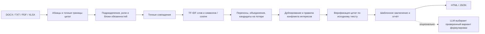

# Контур ответственности

Доказательное сравнение организационной структуры и функций до и после реорганизации.
HackAlem AI 2026, кейс 11, команда Stroit AI.

Сотруднику, который согласует организационные изменения, приходится вручную искать
обязанности в разных редакциях положений. Перенумерация похожа на удаление, общая
управленческая обязанность — на дубль, а новая мера независимости — на конфликт.
«Контур ответственности» сопоставляет содержание и владельцев, показывает основания
каждого вывода и помогает составить список вопросов для ответственного сотрудника.

Это отчёт с проверяемыми источниками, а не чат. **Нет цитаты — нет вывода.**

## Запуск одной командой

Из корня репозитория:

```bash
python3 -m app
```

Откройте **http://localhost:8000**. API-ключи, Node.js и сборка фронтенда не нужны.
При первом запуске команда создаёт `.venv` и устанавливает фиксированные зависимости
из `requirements.txt`. Нужны **Python 3.9+ с pip/venv**, доступ в интернет для первой
установки и право записи в папку проекта. Последующие запуски и весь локальный анализ
работают без интернета. В Windows используйте `python -m app`.

Остановка: `Ctrl+C`. Если порт занят: `PORT=8001 python3 -m app`.
Данные не сохраняются на диск: последние 20 отчётов хранятся в памяти процесса.
После перезапуска сервера анализ нужно выполнить заново; сохранённый HTML автономен.

Второй путь, при установленном Docker:

```bash
docker compose up --build
```

Затем тот же адрес http://localhost:8000. Docker-конфигурация приложена; основной
проверенный путь — Python. Контейнер не получает API-ключи из окружения автоматически.

## Демо за три шага

1. Нажмите **«Загрузить демо-комплект»**. Встроены редакции 8 и 9 положения о внутреннем
   аудите. Сводка покажет ДИТААД и ДОА как созданные, ДНМ и ДККМ как сохранённые;
   в подразделениях и ролях найдите преобразование директора направления.
2. В таблице функций выберите **«Перенесено»** и введите **«взаимодействует с субъектами»**.
   Откройте **«Две цитаты»**: старый **§5.4.4 → новый §5.3.3**. Функция сохранена в другом
   блоке ответственности, хотя номер и начало формулировки изменились.
3. Проверьте **«Риски»**, затем скачайте **HTML** и **JSON** в разделе **«Экспорт»**.
   HTML содержит заключение, таблицы и дословные цитаты; его можно открыть без сервера,
   распечатать или открыть в Word. Прямой DOCX-экспорт в этом прототипе не реализован.

Для своих данных выберите один или несколько файлов в каждом из двух слотов и
нажмите «Сравнить документы». DOCX и TXT демо — дубли одного документа: достаточно
одного формата на редакцию, не загружайте обе копии как независимые документы.

## Экраны и взаимодействие

- Загрузка двух комплектов и реальные этапы обработки; ошибки с инструкцией исправления.
- Сводка подразделений и функций; заключение из 5–7 предложений на демо-комплекте.
  На небольшом комплекте выводов может быть меньше: неподтверждённый текст не добавляется.
- Схема «было → стало» с линиями переноса. Узел фильтрует таблицу по владельцу;
  список переносов дублирует линии текстом, в том числе на мобильном экране.
- Таблица со статусом, владельцами, пунктами, сходством, поиском и фильтрами.
  Две цитаты рядом, подсветка слов, отсутствующих в соседнем фрагменте.
- Возможные потери, дублирования и конфликты с рекомендациями. Меры предотвращения
  конфликта показаны отдельно и не входят в счётчик потенциальных нарушений.
- Метод, режим и фактическое время обработки; HTML/JSON-экспорт.

Русский интерфейс, клавиатурная навигация, видимый фокус, native dialog с Escape,
объявление прогресса через aria-live, работа на ширине 375px. Длинная таблица имеет
собственную горизонтальную прокрутку. Фильтры хранятся в URL; сам отчёт после обновления
страницы нужно построить заново. Исходные документы в браузерное хранилище не записываются.

## Архитектура



| Модуль | Задача |
| --- | --- |
| `app/__main__.py` | Автоматическое создание окружения и запуск |
| `app/server.py` | Локальный HTTP-сервер, multipart, прогресс, экспорт |
| `app/parser.py` | TXT, DOCX через OOXML, XLSX по строкам, PDF через pypdf; номера пунктов и абзацев |
| `app/matching.py` | Ответственность, TF-IDF, сопоставление, проверка источников |
| `app/risks.py` | Правила рисков, счётчики, заключение |
| `app/llm.py` | Ограниченный редактор формулировок и fallback |
| `app/export.py` | Автономный HTML и JSON |
| `app/config.py` | Пороги сходства |
| `static/` | HTML/CSS/JavaScript без сборщика и внешних CDN |
| `test/` | Контрольные, синтетические, API и clean-start тесты |

Имена подразделений извлекаются из структуры и заголовков, а не из словаря демо.
Сопоставление подразделений идёт по аббревиатуре, затем по нормализованному названию;
похожее переименование обозначается как возможное преобразование.

Функции извлекаются из нумерованных блоков обязанностей и аналогичных разделов.
Буквенные подпункты включаются в цитату родительской функции. Оглавление отбрасывается,
склеенные номера разделяются, переносы внутри слов исправляются **только в тексте для
сравнения**. Дословный источник остаётся неизменным.

Сначала резервируются точные соответствия с тем же владельцем, затем остальные точные
совпадения, затем TF-IDF. Учтены объединения нескольких старых функций в одну новую:
занятый кандидат не означает потерю. Явное добавление отрицания снижает сходство.

Пороги в `app/config.py`: сопоставление **0.62**, дублирование **0.88**; веса TF-IDF слов
**0.45**, символьных четырёхграмм **0.55**. Порог проверен на демо и синтетике; это не
калиброванная вероятность правильности и не универсальная оценка качества.

Статусы функций: `kept`, `moved`, `reworded`, `lost`, `added`. Дублирование — независимая
отметка `duplicated: true`, поскольку перенесённая функция одновременно может дублировать
другую. Фильтр и счётчик `duplicated` учитывают эту отметку. Сумма всех счётчиков функций
с учётом дублирования поэтому может быть больше количества строк.

## Как проверяется «нет цитаты — нет вывода»

У ссылки есть имя файла, редакция, пункт, абзац, дословная цитата и символьные границы.
Верификатор проверяет `source[start:end] == quote`. Для функций и подразделений необходимы
ссылки на обе редакции. Риски и заключение включают не меньше двух ссылок; у дублирования
дополнительно представлены обе функции из новой редакции. Без валидных цитат вывод
исключается. Для DOCX/PDF/XLSX исходником цитирования является извлечённый текст; для TXT —
декодированный текст файла. Страницы не вычисляются.

**Ссылка подтверждает фрагмент, но не автоматически интерпретацию.** У созданного
подразделения или добавленной функции старой прямой цитаты по определению нет. Показываем
старый контекст (`relation=context` или `nearest_candidate`) с явной пометкой. Аналогично
для возможной потери показываем старую функцию и ближайший новый кандидат. Отсутствие
достаточно близкого совпадения — повод проверить комплект, а не доказательство утраты.
Все потери, преобразования и нечёткие соответствия требуют проверки.

Правила конфликта: один владелец исполняет и проверяет сходный объект; упоминаются
конфликт интересов или прежняя ответственность аудитора. Профилактические формулировки
не объявляются нарушением. Сложные назначения и реальный конфликт требуют ручного анализа.

## Детерминизм и время

Без включённого LLM одинаковые файлы с одинаковыми именами и порядком дают идентичный
JSON, включая `run_id`. Текущие настройки и версия кода также должны совпадать.
Реальное время не включено в воспроизводимый JSON: поле `elapsed_ms` зарезервировано и
равно **0**. Фактическая длительность доступна в заголовке `Server-Timing`, в последнем
событии потока прогресса и в интерфейсе. Время не выдаётся за нулевое время анализа.

## Опциональный LLM

По умолчанию внешних запросов нет, даже если ключ уже есть в окружении. Для включения
редактора задайте `ENABLE_LLM=1` и `OPENAI_API_KEY` через окружение. На macOS, если ключ
заранее сохранён в Keychain под именем `openai-api-key`:

```bash
export OPENAI_API_KEY="$(security find-generic-password -s openai-api-key -w)"
ENABLE_LLM=1 python3 -m app
```

Ключ не передаётся в командной строке, не пишется в конфиг или журнал. `OPENAI_MODEL`
можно задать отдельно; по умолчанию `gpt-4.1-mini`. Используется
[Responses API](https://developers.openai.com/api/docs/guides/migrate-to-responses) с
`store: false`, тайм-аутом 12 секунд и без инструментов.

Во внешний API отправляются только варианты предложений заключения, включая названия
подразделений, пункты и числа. Полные документы и цитаты не отправляются. Включайте режим
только для документов, разрешённых к такой обработке.

LLM выбирает более понятный вариант из конечного набора проверенных формулировок.
Свободное переписывание намеренно ограничено: модель возвращает только ID факта и индекс
варианта. Неизвестный ID, новый текст, лишние данные, неверный индекс или ошибка сети
приводят к полному fallback на исходное заключение. Факты, числа, пункты, цитаты и статусы
не могут измениться. Это ограниченный редактор, не дополнительный источник выводов.
Без реального ключа проверены mock-success, отказ валидации и fallback; платный запрос
при разработке не выполнялся. Детерминизм гарантируется для основного режима, не для
выбора редакторских вариантов внешней моделью.

## API

| Метод | Путь | Результат |
| --- | --- | --- |
| POST | `/api/analyze` | Multipart: `before[]`, `after[]`; JSON отчёта |
| POST | `/api/demo` | Анализ встроенных редакций 8 и 9 |
| GET | `/api/export/{run_id}?format=html` | Заключение и таблицы с цитатами |
| GET | `/api/export/{run_id}?format=json` | Полный воспроизводимый отчёт |
| GET | `/api/health` | `{status: "ok", mode: "deterministic"}` — доступность ядра |

Основные поля отчёта: `run_id`, `units`, `functions`, `risks`, `conclusion` (массив фактов
с `text` и `evidence`), `pipeline`, `mode`, `elapsed_ms`, `counts`, `verification`.
`before_ref/after_ref` у подразделений и `before/after` у функций содержат ссылки.
`confidence` — сходство текстов; для потери/добавления это сходство ближайшего кандидата.
`kind=prohibition` отличает запреты от обязанностей; запреты не участвуют в поиске дублей.

Для живого прогресса клиент передаёт `Accept: application/x-ndjson`: сервер отправляет
строки `{progress: ...}`, затем `{report: ..., elapsed_ms: ...}`. Без этого заголовка
контракт обычного JSON сохраняется. Некорректные файлы дают JSON-ошибку 400/422,
отсутствующий отчёт — 404, чужой Origin — 403. `format=docx` возвращает понятную ошибку 400.

Ограничения: 15 МБ на файл, 32 МБ на комплект, до 12 файлов, до 600 000 символов на файл,
до 2400 распознанных пунктов суммарно, PDF до 250 страниц. Сервер слушает только localhost
(в Docker наружу также публикуется только 127.0.0.1). Не предназначен для публичного
развёртывания без аутентификации, очереди задач и усиленных ресурсных лимитов.

## Тесты

После первого запуска:

```bash
.venv/bin/python -m unittest discover -s test -v
```

На Windows: `.venv\Scripts\python -m unittest discover -s test -v`.

Контроль: новые/сохранённые подразделения, правильный преемник роли директора,
§5.4.4 → §5.3.3, все цитаты и заключения, идентичный JSON, DOCX и грязный TXT.
Синтетика: копия редакции 9 с удалённым §5.5.6 и копией §5.4.5 в §5.5.11 другого
департамента. Отдельно проверяются объединение функций, отрицания, другой набор
подразделений, самопроверка и отличение профилактики от нарушения, PDF/XLSX,
невалидные файлы, подмена цитат, HTML escaping, LLM validation/fallback,
HTTP health/demo/multipart DOCX/прогресс/экспорт/ошибки.

Создать контрольные файлы для ручной загрузки в интерфейс:

```bash
python3 -m test.synthetic --output /tmp/orgstructure-control
```

Проверить запуск с нуля, без `.venv`, API-ключей и зависимостей текущего проекта:

```bash
python3 test/clean_start.py
```

Скрипт копирует только материалы проекта в новую временную папку, запускает ровно
`python -m app`, проверяет API/демо/экспорт и прогоняет все тесты в новом окружении.
Сервер останавливается, папка и лог сохраняются для проверки. Ничего из проекта не удаляется.

## Ограничения и следующий шаг

Выводы **рекомендательные**, требуют проверки ответственным сотрудником. Сходство текста
не равно полной семантической эквивалентности: сложные разделения обязанностей, изменения
объекта и условия исключений могут потребовать ручного решения. Пустой список рисков
не означает отсутствие рисков. Пересечения общих обязанностей могут быть обоснованными.

Основной формат функций — номера вида `5.3.1` под владельцем `5.3`. Документы без
нумерации можно прочитать, но автоматическое извлечение функций будет ограниченным.
PDF нужен с текстовым слоем; OCR не входит в прототип. DOCX читается из основного тела
документа без восстановления Word auto-numbering и сложной вёрстки. XLSX обрабатывается
как строки текста, без вычисления формул и распознавания графических оргсхем.
Приложение 1 упомянуто в демо, но фактически не приложено: его содержание не выдумывается.

Следующие шаги: размеченный независимый контрольный набор и метрики precision/recall,
улучшение русской морфологии и разделения/объединения функций, OCR, сложные Word-списки,
проверка внешних регуляторных требований с цитатами и бенчмарк других операторов.

## Этапы H1–H4

- H1: парсер, подразделения, загрузка и демо.
- H2: сопоставление функций, проверка цитат, таблица и контрольные тесты.
- H3: риски, сводка, заключение и схема переносов.
- H4: экспорт, ограниченный LLM с fallback, синтетический комплект, README,
  API/браузерная проверка и запуск из чистой папки.

Каждый этап зафиксирован отдельным коммитом с префиксом H1, H2, H3 или H4.
Это завершённые этапы плана, а не утверждение о четырёх часах фактического времени.
Дизайн и проверки интерфейса: [docs/ui-review.md](docs/ui-review.md).
